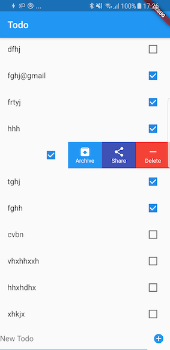

# more_todo

A to-do app written in Flutter.
To learn how Moor works.

## Moor
* [Moor github](https://github.com/simolus3/moor)
* [Moor website](https://moor.simonbinder.eu/)
* [package: moor_ffi](https://pub.dev/packages/moor_ffi)
* [Moor Getting Started](https://moor.simonbinder.eu/docs/getting-started/)

### Other Resources
* [Moor (Room for Flutter) #1 – Tables & Queries – Fluent SQLite Database](https://www.youtube.com/watch?v=zpWsedYMczM&feature=youtu.be)

This video uses moor_flutter but we are using moor_ffi. (newer).

### To generate code
```
flutter packages pub run build_runner build
```
or:
```
flutter packages pub run build_runner watch
```

## Changelog
### v0.1.0
Single screen of TODOs in a list.
To show the simplest usage of local database.



* Add: from bottom input field.
* Delete: Slide and click the delete action.
* Update: Check/Uncheck the checkbox to mark item as completed or not.
* Query: Watch all todos in database and show them in list.
